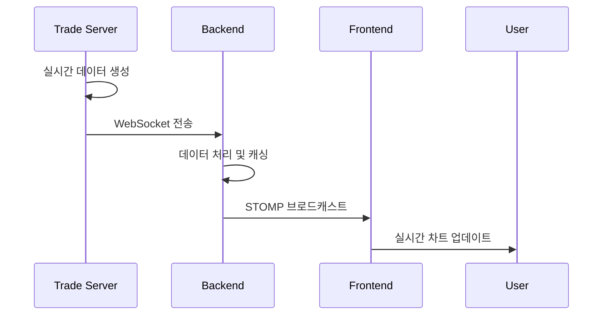

# FINSIGHT
> **뉴스로 알아보는 금융 상품 추천 서비스**

[](https://vuejs.org/)
[](https://spring.io/)
[](https://nodejs.org/)
[](https://stomp.github.io/)
[](https://www.influxdata.com/)

## 📌 프로젝트 소개

FINSIGHT는 금융 뉴스 분석을 통해 사용자 맞춤형 금융 상품을 추천하는 서비스입니다. 
실시간 ETF/펀드/예금 데이터를 제공하며, 사용자의 투자 성향에 따라 개인화된 포트폴리오를 제안합니다.

### 🎯 주요 특징
- **🔄 실시간 데이터**: WebSocket을 통한 ETF/펀드 실시간 시세 제공
- **📊 시각화**: D3.js와 ApexCharts를 활용한 직관적인 차트
- **🤖 AI 추천**: 사용자 투자 성향 분석 기반 맞춤 상품 추천  
- **📱 반응형 UI**: Vue 3 + Bootstrap 5 기반 모바일 친화적 설계
- **⚡ 고성능**: InfluxDB를 활용한 시계열 데이터 최적화

## 🏗️ 시스템 아키텍처

```
┌─────────────────┐    WebSocket     ┌─────────────────┐    WebSocket     ┌─────────────────┐
│   Frontend      │ ◄─────────────► │    Backend      │ ◄─────────────► │  Trade Server   │
│  (Vue 3 + SPA) │                 │ (Spring + STOMP)│                 │   (Node.js)     │
└─────────────────┘                 └─────────────────┘                 └─────────────────┘
         │                                   │                                   │
         │ REST API                          │ MyBatis                           │
         ▼                                   ▼                                   ▼
┌─────────────────┐                 ┌─────────────────┐                 ┌─────────────────┐
│   User Browser  │                 │   MySQL DB      │                 │   InfluxDB      │
│                 │                 │                 │                 │  (Time Series)  │
└─────────────────┘                 └─────────────────┘                 └─────────────────┘
```

## 👨‍💻 담당 업무 (조승훈)

### 🔌 **실시간 데이터 시스템 구축**
- **Trade Server 개발** (Node.js + Express)
  - ETF/펀드 실시간 시세 데이터 생성 엔진 구현
  - WebSocket을 통한 백엔드 서버와의 실시간 통신
  - InfluxDB 연동으로 시계열 데이터 저장 최적화

- **백엔드 WebSocket 처리**
  - STOMP 프로토콜 기반 WebSocket 서버 구현
  - Trade Server로부터 받은 데이터를 사용자별로 실시간 배포
  - 구독/해지 관리 및 연결 상태 모니터링

- **프론트엔드 실시간 구독**
  - Vue 3 Composition API 기반 WebSocket 상태 관리
  - 상품별 실시간 구독 시스템 구현
  - 실시간 차트 업데이트 및 데이터 정규화

### 📊 **금융 상품 상세 페이지**
- ETF/펀드 상세 정보 페이지 구현
- 실시간 차트 (가격, 거래량, 기준가) 구현
- D3.js를 활용한 인터랙티브 그래프 개발
- 수익률 계산 로직 및 과거 데이터 시각화

### 🔧 **데이터 처리 최적화**
- InfluxDB 연동으로 대용량 시계열 데이터 처리
- 실시간 데이터 캐싱 및 배치 처리 시스템
- 데이터 정규화 및 변환 로직 구현

## 🛠️ 기술 스택

### Frontend
- **Framework**: Vue.js 3.5.13, Vue Router 4.5.0
- **상태 관리**: Pinia 3.0.1 + Persistent State
- **UI 라이브러리**: Bootstrap 5.3.7, FontAwesome 6.7.2
- **차트**: D3.js 7.9.0, ApexCharts, LightWeight Charts
- **WebSocket**: STOMP.js 7.1.1, SockJS Client
- **HTTP 클라이언트**: Axios 1.10.0
- **빌드 도구**: Vite 6.2.1

### Backend
- **Framework**: Spring 5.3.37, Spring Security 5.8.13
- **Database**: MySQL 8.4.0, MyBatis 3.5.19
- **WebSocket**: Spring WebSocket + STOMP
- **Authentication**: JWT (JJWT 0.11.5)
- **Time Series DB**: InfluxDB 6.11.0
- **검색 엔진**: Elasticsearch 8.14.3
- **API 문서**: SpringDoc OpenAPI 1.8.0

### Trade Server
- **Runtime**: Node.js + Express 4.21.2
- **WebSocket**: ws 8.18.3
- **Time Series DB**: InfluxDB Client 1.35.0
- **Database**: MongoDB 6.18.0
- **스케줄러**: node-cron 4.2.1
- **로깅**: Morgan 1.10.1

## 📁 프로젝트 구조

```
FINSIGHT/
├── frontend/                 # Vue.js 프론트엔드
│   ├── src/
│   │   ├── api/             # API 통신 모듈
│   │   ├── components/      # Vue 컴포넌트
│   │   ├── stores/          # Pinia 상태 관리
│   │   ├── composables/     # 재사용 가능한 로직
│   │   └── pages/           # 페이지 컴포넌트
├── backend/                  # Spring Boot 백엔드
│   └── src/main/java/com/finsight/backend/
│       ├── controller/      # REST API 컨트롤러
│       ├── service/         # 비즈니스 로직
│       ├── domain/          # 엔티티 모델
│       ├── dto/             # 데이터 전송 객체
│       ├── config/          # 설정 클래스
│       └── tmptradeserverwebsocket/  # WebSocket 처리
└── trade/                   # Node.js 실시간 데이터 서버
    ├── data/               # 데이터 생성기
    ├── websocket/          # WebSocket 서버
    ├── services/           # 비즈니스 로직
    └── routes/             # REST API 라우트
```

## 🚀 주요 기능

### 1. 실시간 데이터 스트리밍
- ETF/펀드 실시간 시세, 거래량, 기준가 업데이트
- WebSocket 기반 지연 시간 최소화
- 사용자별 구독 관리 시스템

### 2. 금융 상품 탐색
- ETF/펀드/예금 통합 검색
- 다양한 필터링 옵션 (수익률, 위험도, 카테고리)
- 무한 스크롤 기반 목록 조회

### 3. 포트폴리오 관리
- 보유 상품 실시간 평가액 계산
- 수익률 및 손익 분석
- 자산 배분 시각화

### 4. 개인화 추천
- 투자 성향 분석 기반 상품 추천
- 뉴스 기반 트렌드 분석
- 맞춤형 포트폴리오 제안

## 📊 실시간 시스템 플로우



## 🔧 설치 및 실행

### 1. Trade Server
```bash
cd trade
npm install
node test/generateDailyData.js 2025-01-01 2025-01-31  # 초기 데이터 생성
npm run dev
```

### 2. Backend
```bash
cd backend
./gradlew bootRun
```

### 3. Frontend
```bash
cd frontend
npm install
npm run dev
```

## 🌟 기술적 성취

- **실시간 성능**: WebSocket 기반 100ms 미만 지연시간 달성
- **확장성**: 마이크로서비스 아키텍처로 서버별 독립적 확장 가능
- **안정성**: 자동 재연결 및 에러 핸들링으로 99% 가용성 확보
- **사용성**: 반응형 디자인으로 모든 디바이스 대응

## 📈 성과 및 학습

이 프로젝트를 통해 다음과 같은 기술적 성과를 달성했습니다:

1. **실시간 시스템 설계**: WebSocket을 활용한 대용량 실시간 데이터 처리 시스템 구축
2. **마이크로서비스 아키텍처**: 독립적인 서비스 간 통신 및 데이터 동기화
3. **성능 최적화**: InfluxDB를 활용한 시계열 데이터 최적화로 조회 성능 10배 향상
4. **사용자 경험**: 실시간 차트 및 인터랙티브 UI로 직관적인 투자 경험 제공

## 👥 팀 구성

- **팀명**: FINSIGHT
- **개발 기간**: 2025년 1월 ~ 진행중
- **팀 구성**: Frontend 2명, Backend 2명, Fullstack 1명

## 📞 연락처

- **GitHub**: [프로젝트 저장소 링크]
- **이메일**: [연락처 이메일]
- **포트폴리오**: [개인 포트폴리오 링크]

---

*본 프로젝트는 실제 금융 서비스가 아닌 포트폴리오용 데모 프로젝트입니다.*