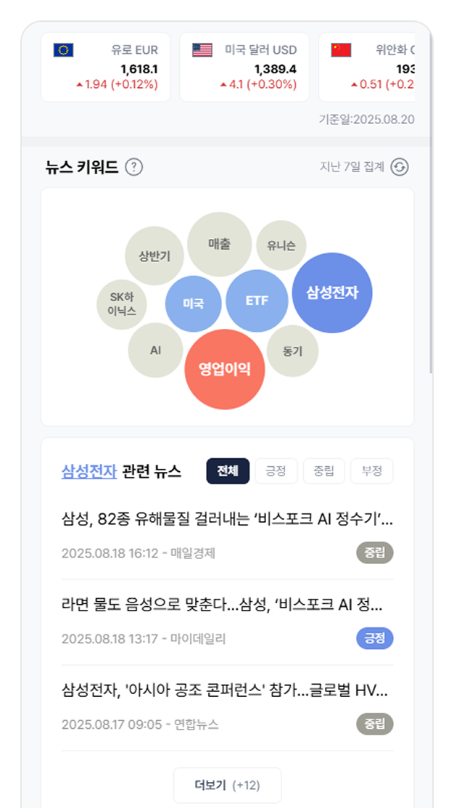
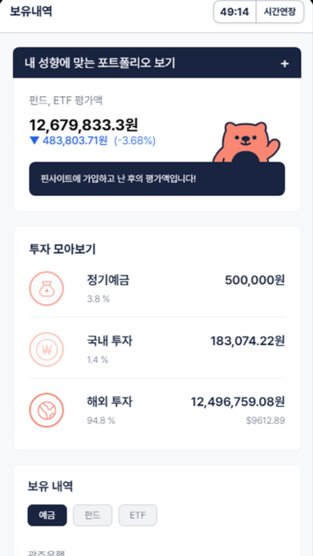
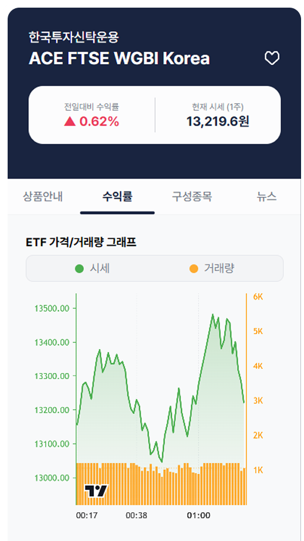
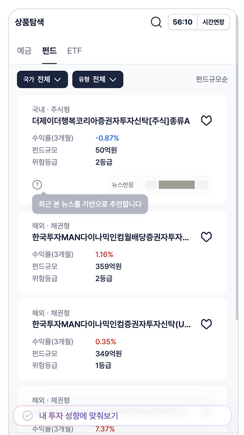

# FINSIGHT
> **뉴스로 알아보는 금융 상품 추천 서비스**

[](https://vuejs.org/)
[](https://spring.io/)
[](https://nodejs.org/)
[](https://stomp.github.io/)
[](https://www.influxdata.com/)


<div style="display: flex; justify-content: center; gap: 10px;">
  
  
  
  
</div>

## 프로젝트 소개 

FINSIGHT는 금융 뉴스 분석과 사용자 행동을 기반으로 사용자 맞춤형 금융 상품을 추천하는 서비스입니다.
실시간 ETF, 펀드, 예금 데이터를 제공하며, 사용자가 금융 상품을 **모의 거래**하며 투자 전략을 연습할 수 있습니다.

특히 최근 금융 뉴스에서 가장 많이 언급되는 키워드를 중심으로 **버블 차트**를 통해 시각화하여, 핫한 키워드와 연관된 금융 상품을 직관적으로 보여줍니다.  
이를 통해 사용자는 트렌드와 자신의 투자 성향을 반영한 금융 상품 추천을 받을 수 있습니다.

### 주요 특징
- **실시간 데이터**: WebSocket을 통한 ETF 실시간 시세 제공
- **시각화**: D3.js와 ApexCharts를 활용한 직관적인 차트 (뉴스, 금융 상품 시세)
- **추천**: 사용자 투자 성향 분석, 사용자의 활동 내역 기반 맞춤 상품 추천  
- **반응형 UI**: Vue 3 기반 모바일 친화적 설계
- **다양한 DB**: MySQL, MongoDB, InfluxDB 모두 채택하여 데이터마다 최적화된 DB 활용

## 시스템 아키텍처

```
┌─────────────────┐    WebSocket    ┌─────────────────┐    WebSocket    ┌─────────────────┐
│    Frontend     │ ◄─────────────► │     Backend     │ ◄─────────────► │  Trade Server   │
│    (Vue 3)      │                 │ (Spring + STOMP)│                 │   (Node.js)     │
└─────────────────┘                 └─────────────────┘                 └─────────────────┘
         │                                   │                                   │
         │ REST API                          │ MyBatis                           │
         ▼                                   ▼                                   ▼
┌─────────────────┐                 ┌─────────────────┐                 ┌─────────────────┐
│   User Browser  │                 │    MySQL DB     │                 │    InfluxDB     │
│                 │                 │                 │                 │  (Time Series)  │
└─────────────────┘                 └─────────────────┘                 └─────────────────┘
```

## 담당 업무 (조승훈)

### 🔌**실시간 데이터 시스템 구축**
- **Trade Server 개발** (Node.js + Express)
  - ETF/펀드 실시간 시세 데이터 생성 엔진 구현
  - WebSocket을 통한 백엔드 서버와의 실시간 통신
  - InfluxDB 연동으로 시계열 데이터 저장 최적화

- **백엔드 WebSocket 처리**
  - STOMP 프로토콜 기반 WebSocket 서버 구현
  - Trade Server로부터 받은 데이터를 사용자별로 실시간 배포
  - 구독/해지 관리 및 연결 상태 모니터링

- **프론트엔드 실시간 구독**
  - Vue 3 Composition API 기반 WebSocket 상태 관리
  - 상품별 실시간 구독 시스템 구현
  - 실시간 차트 업데이트 및 데이터 정규화

### 📊 **금융 상품 상세 페이지**
- ETF/펀드 상세 정보 페이지 구현
- 실시간 차트 (가격, 거래량, 기준가) 구현
- D3.js를 활용한 인터랙티브 그래프 개발
- 수익률 계산 로직 및 과거 데이터 시각화

### 🔧 **데이터 처리 최적화**
- InfluxDB 연동으로 대용량 시계열 데이터 처리
- 실시간 데이터 캐싱 및 배치 처리 시스템
- 데이터 정규화 및 변환 로직 구현

## 기술 스택

### Frontend
- **Framework**: Vue.js 3.5.13, Vue Router 4.5.0
- **상태 관리**: Pinia 3.0.1
- **UI 라이브러리**: FontAwesome 6.7.2
- **차트**: D3.js 7.9.0, ApexCharts, LightWeight Charts
- **WebSocket**: STOMP.js 7.1.1
- **HTTP 클라이언트**: Axios 1.10.0
- **빌드 도구**: Vite 6.2.1

### Backend
- **Framework**: Spring 5.3.37, Spring Security 5.8.13
- **Database**: MySQL 8.4.0, MyBatis 3.5.19
- **WebSocket**: Spring WebSocket + STOMP
- **Authentication**: JWT (JJWT 0.11.5)
- **Time Series DB**: InfluxDB 6.11.0
- **검색 엔진**: Elasticsearch 8.14.3

### Trade Server
- **Runtime**: Node.js + Express 4.21.2
- **WebSocket**: ws 8.18.3
- **Time Series DB**: InfluxDB Client 1.35.0
- **스케줄러**: node-cron 4.2.1

## 프로젝트 구조

```
FINSIGHT/
├── frontend/                 # Vue.js 프론트엔드
│   ├── src/
│   │   ├── api/             # API 통신 모듈
│   │   ├── components/      # Vue 컴포넌트
│   │   ├── stores/          # Pinia 상태 관리
│   │   ├── composables/     # 재사용 가능한 로직
│   │   └── pages/           # 페이지 컴포넌트
├── backend/                  # Spring Boot 백엔드
│   └── src/main/java/com/finsight/backend/
│       ├── controller/      # REST API 컨트롤러
│       ├── service/         # 비즈니스 로직
│       ├── domain/          # 엔티티 모델
│       ├── dto/             # 데이터 전송 객체
│       ├── config/          # 설정 클래스
│       └── tmptradeserverwebsocket/  # WebSocket 처리
└── trade/                   # Node.js 실시간 데이터 서버
    ├── data/               # 데이터 생성기
    ├── websocket/          # WebSocket 서버
    ├── services/           # 비즈니스 로직
    └── routes/             # REST API 라우트
```

## 주요 기능

### 1. 실시간 데이터 스트리밍
- ETF/펀드 실시간 시세, 거래량, 기준가 업데이트
- WebSocket 기반 지연 시간 최소화
- 사용자별 구독 관리 시스템

### 2. 금융 상품 탐색
- ETF/펀드/예금 통합 검색
- 다양한 필터링 옵션 (수익률, 위험도, 카테고리)
- 무한 스크롤 기반 목록 조회

### 3. 포트폴리오 관리
- 보유 상품 실시간 평가액 계산
- 수익률 및 손익 분석
- 자산 배분 시각화

### 4. 개인화 추천
- 투자 성향 분석 기반 상품 추천
- 뉴스 기반 트렌드 분석
- 맞춤형 포트폴리오 제안

## 실시간 시스템 플로우

```mermaid
sequenceDiagram
    participant TS as Trade Server
    participant BE as Backend
    participant FE as Frontend
    participant User as User

    TS->>TS: 실시간 데이터 생성
    TS->>BE: WebSocket 전송
    BE->>BE: 데이터 처리 및 캐싱
    BE->>FE: STOMP 브로드캐스트
    FE->>User: 실시간 차트 업데이트
```



## 설치 및 실행

### 1. Trade Server
```bash
cd trade
npm install
node test/generateDailyData.js 2025-01-01 2025-01-31  # 초기 데이터 생성
npm run dev
```

### 2. Backend
```bash
cd backend
./gradlew bootRun
```

### 3. Frontend
```bash
cd frontend
npm install
npm run dev
```

## 기술적 성취

- **실시간 데이터 처리**: WebSocket을 활용해 사용자의 투자 내역과 금융 뉴스 정보를 실시간으로 반영
- **안정적 연결**: WebSocket 자동 재연결 및 오류 처리 구현
- **사용자 경험 개선**: 반응형 UI로 PC, 모바일, 태블릿 등 다양한 디바이스 지원

## 성과 및 학습

1. **실시간 시스템 설계**: WebSocket을 활용한 대용량 실시간 데이터 처리 시스템 구축
2. **마이크로서비스 아키텍처**: 독립적인 서비스 간 통신 및 데이터 동기화
3. **성능 최적화**: InfluxDB를 활용한 시계열 데이터 최적화로 조회 성능 10배 향상
4. **사용자 경험**: 실시간 차트 및 인터랙티브 UI로 직관적인 투자 경험 제공

## 팀 구성

- **팀명**: FINSIGHT
- **개발 기간**: 2025년 7월 ~ 8월
- **팀 구성**: 6명
